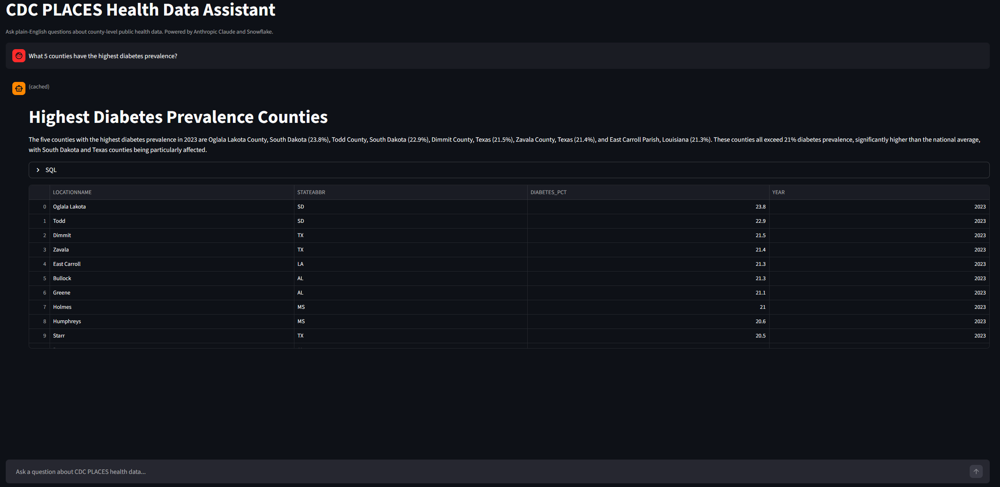

# cdc-places-nl-sql

Natural-language SQL assistant for CDC PLACES health data. Translates plain-English questions into Snowflake SQL using the Anthropic Claude API, executes them, and returns plain-English answers.

[](https://github.com/qowboykay/cdc-places-nl-sql/actions/workflows/ci.yml)


> **Depends on [cdc-places-pipeline](https://github.com/qowboykay/cdc-places-pipeline).** The Snowflake schema this project queries is built and maintained by that pipeline.

---

## Architecture

```
User question  (Streamlit chat or CLI)
        |
        v
  Schema introspection  (INFORMATION_SCHEMA -> compact schema description)
        |
        v
  SQLite cache lookup  (skip Claude + Snowflake on repeated questions)
        |
        v
  Claude Sonnet  (question + schema -> read-only Snowflake SQL)
        |
        v
  SQL safety validator  (sqlparse: reject non-SELECT, inject LIMIT cap)
        |
        v
  Snowflake  (execute validated query -> DataFrame)
        |
        v
  Claude Haiku  (DataFrame + question -> plain-English answer)
        |
        v
  Streamlit chat interface  (expandable SQL, result table, plain-English summary)
```

---

## Tech Stack

| Layer | Tool |
|---|---|
| LLM | Anthropic Claude API (`anthropic` SDK) |
| SQL generation | Claude Sonnet |
| Result summarization | Claude Haiku |
| Warehouse | Snowflake (same schema as cdc-places-pipeline) |
| SQL safety | `sqlparse` + custom validator |
| Response cache | SQLite (`cache.sqlite`) |
| Interface | Streamlit |
| Testing | `pytest` |
| Linting / formatting | `ruff` |
| Type checking | `mypy` |
| Package manager | `uv` |

---

## Setup

**Prerequisites:** Python 3.11+, [uv](https://docs.astral.sh/uv/), an Anthropic API key, and a Snowflake account with the [cdc-places-pipeline](https://github.com/qowboykay/cdc-places-pipeline) schema loaded.

```bash
# Clone and install
git clone https://github.com/qowboykay/cdc-places-nl-sql.git
cd cdc-places-nl-sql
uv sync --all-groups

# Configure environment
cp .env.example .env
# Fill in ANTHROPIC_API_KEY and all SNOWFLAKE_* values in .env

# Install pre-commit hooks
uv run pre-commit install
```

### Run the chat interface

```bash
uv run streamlit run app/chat.py
```

Open [http://localhost:8501](http://localhost:8501) in a browser.



### Run via CLI

```bash
uv run python -m cdc_places_nl_sql.cli ask "What 5 counties have the highest diabetes prevalence?"

# Show the generated SQL alongside the answer
uv run python -m cdc_places_nl_sql.cli ask --show-sql "Which states have the lowest obesity rates?"
```

---

## Example Questions

```
What 5 counties have the highest diabetes prevalence?
Which states have the lowest rates of colorectal cancer screening?
Compare obesity rates between rural and urban counties in Texas.
Show me counties where both smoking and diabetes prevalence exceed 20%.
```

---

## Roadmap

| Phase | Description | Status |
|---|---|---|
| 1 | NL-SQL foundation: schema introspection, Claude integration, SQL safety, CLI | Done |
| 2 | Streamlit chat interface, error recovery, SQLite cache | Done |
| 3 | Polish, docs, tagged release | Done |

---

## Related Project

[cdc-places-pipeline](https://github.com/qowboykay/cdc-places-pipeline): The ELT pipeline that builds and maintains the Snowflake schema this assistant queries.
